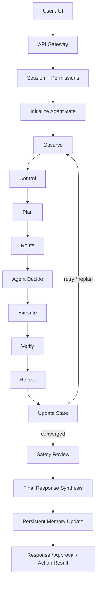

# Neeraj AI OS Architecture

This backend uses a `src/` package layout while the working orchestration runtime lives in `agent_runtime/`. The runtime is designed as a stateful cognitive architecture, not a single-model wrapper or a one-pass pipeline. The `src/runtime/` package is the stable facade that exposes the active runtime contracts to the API and frontend layers.

## Design Principles

- The LLM is a planner/synthesizer, not the entire system.
- State is explicit and evolves through a closed loop rather than a stateless pipeline.
- Memory is explicit and retrieval-based rather than implicit in prompt history alone.
- Each iteration applies the explicit transition `S_{t+1} = F(S_t, O_t)`.
- Tool use is governed, evidence-producing, and safety-aware.
- Verification is binding and can force retry or replanning.
- Reflection is causal and writes repairs back into the shared state.
- Specialists are modular and swappable behind a shared orchestration contract.

## Package Map

- `main.py`: Thin entrypoint that boots the FastAPI app from `src.api.routes`.
- `app.py`: Streamlit entrypoint for the research-grade local frontend.
- `src/api/`: FastAPI routes and dependencies.
- `src/core/`: Config, logging, and permission helpers.
- `src/schemas/`: Shared request, response, catalog, and observability schema exports.
- `src/graph/`: Graph and state wrappers kept as structural facades.
- `src/agents/`: Typed specialist catalog plus agent-facing compatibility modules.
- `src/tools/`: Shared tool catalog, tool family groupings, and runtime tool adapter surface.
- `src/memory/`: Episodic, semantic, retrieval, and `MemoryManager` lifecycle helpers.
- `src/runtime/`: Stable backend-facing facade over runtime models, workflow descriptors, and factory functions.
- `src/services/`: LLM integration, orchestration service, and runtime lifecycle coordination.
- `src/safety/`: Approvals, audit, and validation helpers.
- `src/utils/`: Small shared utility helpers.
- `agent_runtime/`: Live orchestration runtime including the shared `AgentState`, control loop, planning, verification, reflection, memory, tools, specialists, and final response synthesis.
- `agent_runtime/specialists/`: Concrete specialist implementations split by domain, with `agent_runtime/agents.py` kept as a compatibility facade.
- `frontend/`: Typed frontend service, session state, controller, and rendering helpers used by the multipage Streamlit interface.
- `pages/`: Streamlit multipage views for chat, agents, memory, logs, and settings.

## Runtime Notes

- `agent_runtime/models.py` defines `AgentState`, the single evolving runtime state object.
- `agent_runtime/orchestrator.py` runs the observe -> control -> plan -> route -> agent decide -> execute -> verify -> reflect -> update state loop until convergence or max steps.
- `src/runtime/models.py` and `src/runtime/workflow.py` provide the stable contracts consumed by the backend and frontend without coupling those layers directly to the implementation package layout.
- `agent_runtime/context_hub.py` refreshes memory, constraints, and context onto the live state at each step.
- `agent_runtime/control.py`, `agent_runtime/planner.py`, and `agent_runtime/router.py` all consume live state rather than disconnected stage inputs.
- `agent_runtime/agents.py` produces internal execution summaries and tool requests, not final user-facing responses.
- `agent_runtime/specialists/` keeps each specialist implementation isolated so routing and execution changes do not accumulate in one monolithic module.
- `src/agents/catalog.py` is the single source of truth for specialist metadata used by the API and UI.
- `src/tools/catalog.py` is the single source of truth for tool metadata used by the runtime, API, and UI.
- `agent_runtime/verification.py` can trigger retry when grounding or execution checks fail.
- `agent_runtime/reflection.py` mutates route bias, blocked tools, and adaptive constraints so later steps change.
- `agent_runtime/models.py` and `agent_runtime/orchestrator.py` now expose explicit per-iteration `StateTransition` records.
- `agent_runtime/responder.py` synthesizes the user-facing response only after the loop finishes.
- `agent_runtime/response_helpers.py` and `agent_runtime/runtime_utils.py` centralize repeated fallback-object and state-utility logic used across the runtime.
- `src/services/runtime_lifecycle.py` and `src/memory/manager.py` keep request hydration, persistence, and audit capture out of the API route layer and out of the core orchestrator.
