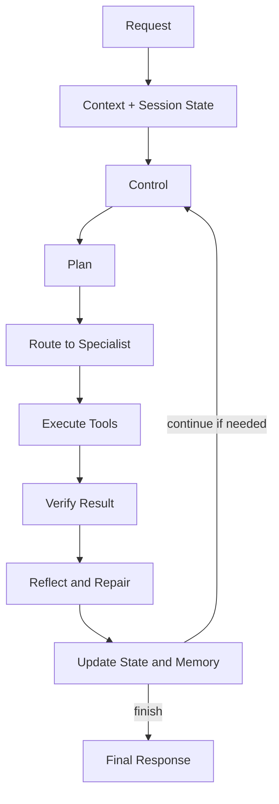

# Neeraj AI OS Architecture

This project is built around a simple idea: the model should not be the whole system. Instead, the model operates inside a stateful runtime that plans, routes, executes, verifies, reflects, and updates memory before producing a final answer.

## Mental Model

Think of the runtime as a controlled loop, not a one-shot response engine.

This means the system can adapt mid-flight instead of blindly returning the first model output.

## High-Level Responsibilities

| Area | Responsibility |
| --- | --- |
| `main.py` | Boots the FastAPI application |
| `app.py` | Boots the Streamlit frontend |
| `src/api` | Public HTTP interface |
| `src/services` | Request orchestration and runtime lifecycle management |
| `src/runtime` | Stable contracts exposed to the rest of the app |
| `agent_runtime` | Live runtime implementation |
| `agent_runtime/specialists` | Specialist-specific decision logic |
| `src/tools` | Tool catalog and tool metadata |
| `src/memory` | Memory persistence and retrieval helpers |
| `src/safety` | Approval, validation, and audit helpers |
| `frontend` and `pages` | Operator-facing UI for interacting with the system |

## Why There Are Two Runtime Layers

The repository intentionally separates the code into:

- `src/`
- `agent_runtime/`

The reason is architectural clarity.

`src/` is the stable application-facing layer. The API, schemas, service wiring, and UI-facing contracts live here.

`agent_runtime/` is the live orchestration engine. It contains the real control loop, runtime state, specialist behavior, and internal execution logic.

That split makes it easier to:

- evolve the runtime without constantly reshaping the API layer
- keep frontend and backend integrations stable
- refactor internals without breaking every import path

## End-to-End Request Lifecycle

### 1. Request enters through FastAPI

`src/api/routes.py` exposes routes like `/chat`, `/plan`, `/execute`, `/agents`, and `/tools`.

### 2. Service layer builds execution context

`src/services/orchestration_service.py` coordinates the request and hands it into the runtime lifecycle.

### 3. Runtime initializes shared state

`agent_runtime/models.py` defines the evolving `AgentState`, which carries context, plan data, memory references, routing decisions, execution traces, and permission state.

### 4. Planner creates structured next steps

`agent_runtime/planner.py` converts the request and current state into a plan rather than immediately producing an answer.

### 5. Router selects the best specialist

`agent_runtime/router.py` decides whether the task belongs to coding, communication, research, browser, file, task, or general handling.

### 6. Specialist decides how to act

`agent_runtime/specialists/` contains the domain-specific behavior, while `agent_runtime/agents.py` preserves a stable compatibility surface.

### 7. Tools execute through a shared registry

The runtime interacts with tool definitions through common tool abstractions rather than hardcoded calls scattered across the codebase.

### 8. Verification checks the result

`agent_runtime/verification.py` can reject a weak result and trigger retry or replanning.

### 9. Reflection adjusts future behavior

`agent_runtime/reflection.py` updates route bias, blocked tools, constraints, and other runtime controls so later steps behave differently.

### 10. Final response is synthesized

`agent_runtime/responder.py` produces the user-facing response only after the loop reaches a stopping condition.

## State-Centric Design

One of the strongest ideas in the project is that state is explicit.

Instead of treating each step as disconnected, the runtime evolves a shared object over time. That gives the system memory of:

- what has already been attempted
- which tools were used
- what failed verification
- which constraints were added during reflection
- which specialist is currently responsible

This makes the runtime easier to inspect, debug, and extend.

## Specialist Design

The specialist model keeps responsibilities narrow:

- `CommunicationAgent` handles messaging and drafting workflows
- `CodingAgent` handles implementation and code-oriented tasks
- `ResearchAgent` handles evidence gathering and synthesis
- `BrowserAgent` handles browser-oriented workflows
- `TaskAgent` handles planning and task coordination
- `FileAgent` handles document and file workflows
- `GeneralAgent` provides fallback coverage

Specialist metadata is exposed from `src/agents/catalog.py`, while live behavior sits inside `agent_runtime/specialists/`.

## Tooling Model

The tooling layer is designed around structured capabilities instead of ad hoc helper functions. That includes:

- cataloged tools
- typed metadata
- graceful fallback behavior
- compatibility between API, runtime, and frontend views

This structure is what allows the runtime to expose both execution and inspection surfaces.

## Memory Model

The platform uses multiple memory layers:

- working memory in the active runtime state
- episodic persistence through MongoDB
- semantic retrieval through an abstraction that can evolve over time

This keeps the system open to stronger long-term memory without forcing every memory concern into prompt history.

## Safety and Observability

The architecture is built to support governed execution, not just successful execution.

Important controls include:

- permission-aware request handling
- audit logging
- validation and verification
- structured traces
- compatibility with approval workflows

That makes the system more suitable for serious automation than a raw tool-calling demo.

## Practical Reading Guide

If you want to understand the codebase quickly, read in this order:

1. `README.md`
2. `src/api/routes.py`
3. `src/services/orchestration_service.py`
4. `agent_runtime/orchestrator.py`
5. `agent_runtime/models.py`
6. `agent_runtime/planner.py`
7. `agent_runtime/router.py`
8. `agent_runtime/verification.py`
9. `agent_runtime/reflection.py`
10. `src/tools/catalog.py`

That path gives you the fastest route from public interface to internal runtime behavior.
