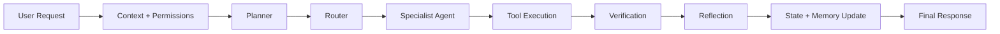

# Neeraj AI OS

Neeraj AI OS is a stateful personal AI agent platform built as a runtime system, not just a chatbot wrapper. It combines planning, specialist routing, tool execution, memory, verification, reflection, and audit logging so the model operates inside a governed workflow instead of a single prompt-response loop.

## What This Project Is

This repository is designed for building a personal AI system that can:

- understand a user request in context
- break work into steps
- route work to the right specialist agent
- use tools in a structured way
- verify its own outputs
- update memory and runtime state across turns

The result is a more deliberate, inspectable, and extensible agent architecture than a typical chat app.

## Why It Feels More Advanced Than a Basic Chatbot

Most chatbot projects stop at:

`user input -> model -> answer`

This project uses a closed-loop runtime:

`observe -> control -> plan -> route -> decide -> execute -> verify -> reflect -> update state`

That gives you a system that is better suited for:

- multi-step tasks
- specialist delegation
- memory-aware workflows
- safety and permission checks
- auditability and future production hardening

## Core Capabilities

- Stateful orchestration through a shared `AgentState`
- Multiple specialists for coding, communication, research, browser, task, file, and general work
- Shared tool registry with typed metadata and structured results
- FastAPI backend for health, planning, chat, execution, audit, tools, and agent catalog access
- Streamlit frontend for local interaction, inspection, and runtime visibility
- MongoDB-backed episodic memory support
- Verification and reflection loops that can trigger retry or replanning
- Safe local fallback behavior when external credentials are missing

## System Flow



## Architecture At a Glance

| Layer | Purpose |
| --- | --- |
| `src/api` | FastAPI routes and request handling |
| `src/services` | Orchestration service and lifecycle management |
| `src/runtime` | Stable facade exposed to backend and frontend |
| `agent_runtime` | Live stateful runtime and orchestration loop |
| `agent_runtime/specialists` | Concrete specialist agent behavior |
| `src/tools` | Tool catalog and tool adapter surface |
| `src/memory` | Memory lifecycle, retrieval, and persistence |
| `src/safety` | Approvals, audit, and validation helpers |
| `frontend` + `pages` | Streamlit UI for chat, logs, memory, and status |

The important design choice is that `src/` provides a stable application-facing surface, while `agent_runtime/` contains the active runtime internals.

## Repository Structure

```text
main.py                  FastAPI entrypoint
app.py                   Streamlit entrypoint
README.md                Project overview
ARCHITECTURE.md          Technical architecture guide

src/
  api/                   HTTP routes and dependencies
  agents/                Typed agent catalog
  core/                  Config, logging, permissions
  graph/                 Graph and state facades
  memory/                Episodic and semantic memory helpers
  runtime/               Stable runtime contracts
  safety/                Approvals, validation, audit helpers
  schemas/               Shared API and catalog models
  services/              Orchestration and LLM integration
  tools/                 Tool catalog and adapters
  utils/                 Shared utility helpers

agent_runtime/
  orchestrator.py        Main closed-loop runtime
  models.py              Shared runtime state models
  planner.py             Planning logic
  router.py              Specialist selection
  execution.py           Tool execution flow
  verification.py        Output validation and retry signals
  reflection.py          Runtime repair and adaptation
  memory.py              Runtime memory wiring
  specialists/           Domain-specific agents

frontend/
pages/
```

## Specialists

The platform includes the following specialist agents:

- `CommunicationAgent`
- `CodingAgent`
- `ResearchAgent`
- `BrowserAgent`
- `TaskAgent`
- `FileAgent`
- `GeneralAgent`

Each specialist is isolated behind a shared orchestration contract so the runtime can route tasks without hardcoding behavior into one large agent file.

## API Surface

Main routes:

- `GET /`
- `GET /health`
- `GET /status`
- `GET /architecture`
- `GET /agents`
- `GET /tools`
- `GET /audit/logs`
- `GET /sessions/{user_id}/{session_id}`
- `POST /chat`
- `POST /plan`
- `POST /execute`
- `POST /interactions`

## Quick Start

### 1. Create and activate a virtual environment

```powershell
python -m venv .venv
.venv\Scripts\activate
```

### 2. Install dependencies

```powershell
pip install -r requirements.txt
```

### 3. Create your environment file

```powershell
Copy-Item .env.example .env
```

### 4. Install browser support

```powershell
playwright install chromium
```

### 5. Start the API

```powershell
uvicorn main:app --reload
```

### 6. Start the frontend

```powershell
streamlit run app.py
```

By default, the Streamlit frontend talks to `http://127.0.0.1:8000`.

## Important Environment Variables

- `OPENAI_API_KEY`
- `OPENAI_CHAT_MODEL`
- `OPENAI_RESPONSES_MODEL`
- `OPENAI_EMBEDDING_MODEL`
- `USE_OPENAI_AGENTS_SDK`
- `MONGODB_URI`
- `MONGODB_DB_NAME`
- `MONGODB_EPISODIC_COLLECTION`
- `MONGODB_TASK_COLLECTION`
- `PLAYWRIGHT_BROWSER`
- `PLAYWRIGHT_HEADLESS`
- `AUDIT_LOG_FILE`
- `NEERAJ_API_URL`
- `NEERAJ_API_TIMEOUT_SECONDS`

If OpenAI credentials or optional services are missing, the project still runs in a deterministic local mode with graceful fallbacks.

## Example Requests

### Health check

```powershell
curl http://127.0.0.1:8000/health
```

### Plan a task

```powershell
curl -X POST http://127.0.0.1:8000/plan ^
  -H "Content-Type: application/json" ^
  -d "{\"user_id\":\"demo\",\"session_id\":\"plan-1\",\"channel\":\"text\",\"message\":\"Design a modular personal AI agent platform.\"}"
```

### Run a chat interaction

```powershell
curl -X POST http://127.0.0.1:8000/chat ^
  -H "Content-Type: application/json" ^
  -d "{\"user_id\":\"demo\",\"session_id\":\"chat-1\",\"channel\":\"text\",\"message\":\"Build a research-grade coding agent architecture.\"}"
```

## Tech Stack

- Python
- FastAPI
- Streamlit
- OpenAI SDK
- OpenAI Agents SDK integration layer
- MongoDB
- Playwright
- LangChain ecosystem components

## Current Direction

This codebase is already structured like a serious agent platform, but some external tool integrations are still intentionally conservative. The next major jump is turning the placeholder-safe tool surfaces into live search, browser, and execution adapters with stronger production-style evaluation and safety gates.

## Best Next Improvements

- Replace stubbed browser and search tools with live adapters
- Add stronger automated evaluation for multi-step workflows
- Expand memory persistence and retrieval quality
- Increase human approval and policy controls for sensitive actions
- Add richer frontend traces for debugging agent decisions

For the deeper technical view, see `ARCHITECTURE.md`.
