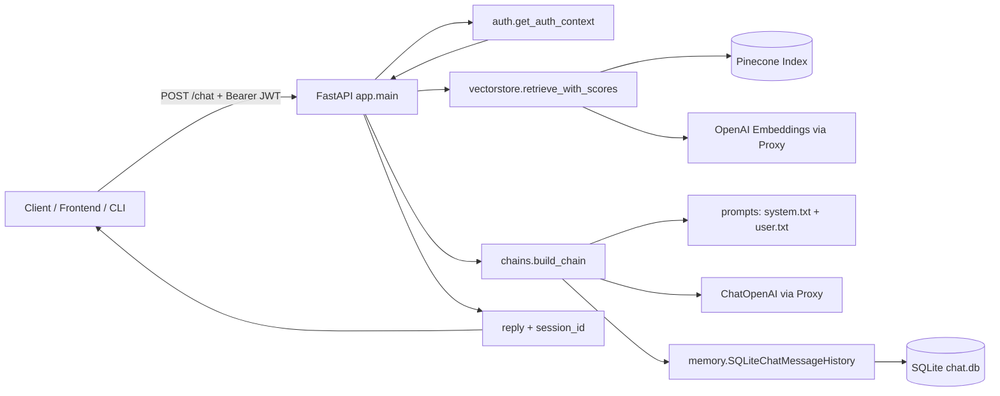
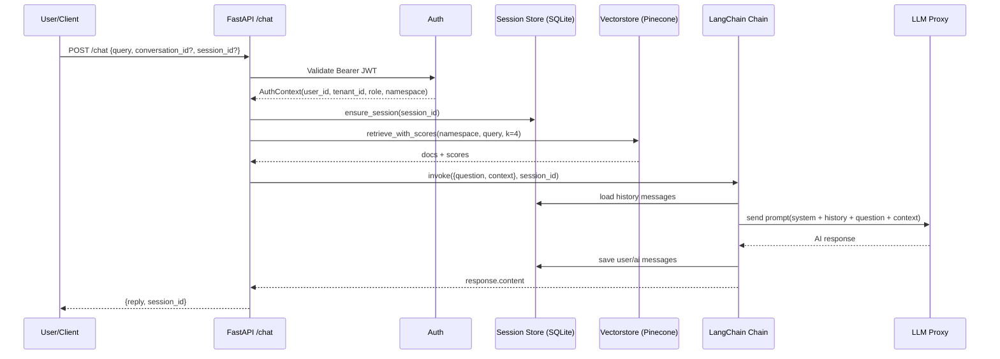
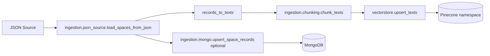

# AI Agent Backend Architecture

## 1) High-Level Overview

## 2) Core Runtime Components

- API Layer: `app/main.py`
  - Endpoints: `/chat`, `/health`
  - Builds session id (`tenant:user:conversation`) if `session_id` missing
  - Retrieves RAG context and invokes LangChain pipeline

- Auth Layer: `app/auth.py`
  - Validates Bearer JWT (`JWT_SECRET`, issuer/audience optional)
  - Extracts `user_id`, `tenant_id`, `role`
  - Creates namespace: `tenant_id:role`
  - Supports local dev bypass via `DEV_AUTH_BYPASS=true`

- Chain Layer: `app/chains.py`, `app/prompts.py`, `app/llm.py`
  - Prompt template: system + history + user question
  - LLM source: Proxy-backed OpenAI (`PROXY_URL`)
  - Fallback: offline mock response when LLM provider unavailable

- Memory Layer: `app/memory.py`, `app/session_store.py`, `app/models.py`
  - Conversation history persisted in SQLite (`chat.db`)
  - Tables:
    - `chat_sessions`
    - `chat_messages`
  - LangChain `RunnableWithMessageHistory` reads/writes chat history automatically

- Retrieval Layer (RAG): `app/vectorstore.py`
  - Vector DB: Pinecone
  - Embeddings: OpenAI embeddings through proxy
  - Retrieval method: `similarity_search_with_score(k=4)`
  - Injects joined document text into prompt as `context`

## 3) /chat Request Flow

## 4) Ingestion/Data Preparation Flow

## 5) Configuration Dependencies

- LLM/Embeddings
  - `PROXY_URL`
  - `OPENAI_MODEL` (optional)
  - `OPENAI_EMBEDDING_MODEL` (optional)
  - `OPENAI_EMBEDDING_DIMENSIONS` (optional)

- Pinecone
  - `PINECONE_API_KEY`
  - `PINECONE_INDEX_NAME`
  - `PINECONE_TEXT_KEY` (optional)

- Auth
  - `JWT_SECRET`
  - `JWT_ALGORITHM` (default `HS256`)
  - `JWT_ISSUER`, `JWT_AUDIENCE` (optional)
  - Claim mapping env vars (`JWT_USER_CLAIM`, etc.)

- Database
  - `DATABASE_URL` (default `sqlite:///./chat.db`)

- Optional Mongo ingestion
  - `MONGODB_URI`
  - `MONGODB_DB`
  - `MONGODB_COLLECTION`

## 6) Design Characteristics

- Multi-tenant separation via `namespace = tenant_id:role` at retrieval layer
- Persistent conversational memory keyed by `session_id`
- Graceful degradation:
  - Retrieval failure => empty context, chat still runs
  - LLM provider missing => offline fallback response
